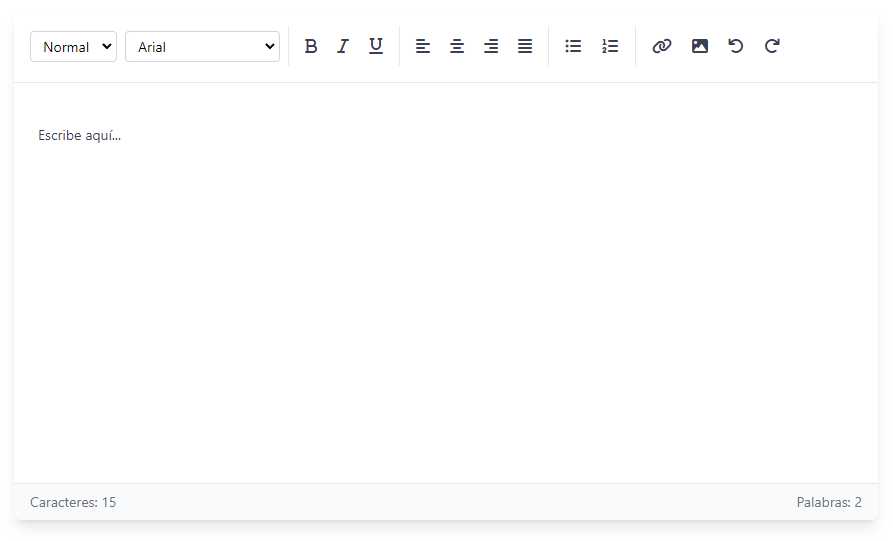

# textifyjs-lib

**textifyjs-lib** is a lightweight and customizable rich-text editor library for modern web applications. It offers a simple, yet powerful, interface to integrate rich-text editing capabilities into your projects.

---

## Features

- 📝 **Rich Text Editing**: Includes formatting options like bold, italic, underline, lists, and links.
- 🎨 **Customizable**: Supports Tailwind CSS and custom styles.
- ⚡ **Fast and Lightweight**: Built for performance and modern workflows.
- 📦 **ESM and UMD Support**: Works seamlessly with bundlers or direct script imports.

---

## Installation

Install via npm:

```bash
npm install textifyjs-lib
```
Or include js/css directly in your HTML file:

```bash
    <script src="https://cdn.jsdelivr.net/npm/textifyjs-lib/dist/textifyjslib.umd.cjs"></script>

    <link rel="stylesheet" href="https://cdn.jsdelivr.net/npm/textifyjs-lib/dist/textifyjslib.css">
```

## Example for use

Example HTML Integration
```bash
    <!doctype html>
    <html lang="en">
    <head>
        <link rel="stylesheet" href="https://cdn.jsdelivr.net/npm/textifyjs-lib/dist/textifyjslib.css">
        <link href="https://cdnjs.cloudflare.com/ajax/libs/font-awesome/6.0.0/css/all.min.css" rel="stylesheet">
        <title>My web</title>
    </head>
    <body>
        <div id="editor-container"></div>
        <script type="module" src="/src/main.js"></script>
    </body>
    </html>

```

Import in a JavaScript Project
```bash
//main.js

    import RichTextEditor from 'textifyjs-lib';

    // Create an instance of the editor
    const editor = new RichTextEditor('#editor-container', {
    placeholder: 'Escribe aquí...',
    toolbar: {
        basic: true,
        formatting: true,
        alignment: true,
        lists: true,
        media: true
    },
    counters: true
    });


    // Get the content
    const content = editor.getContent();

    // Set content
    editor.setContent('<p>New content</p>');

    // Destroy the editor
    editor.destroy();

```

### Preview

