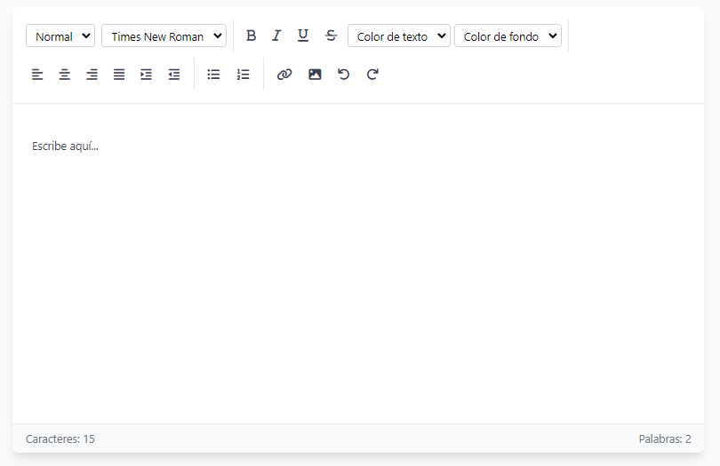

# textifyjs-lib

**textifyjs-lib** is a lightweight and customizable rich-text editor library for modern web applications. It offers a simple, yet powerful, interface to integrate rich-text editing capabilities into your projects.

---

## Features

- 📝 **Rich Text Editing**: Includes formatting options like bold, italic, underline, lists, and links.
- ⚡ **Fast and Lightweight**: Built for performance and modern workflows.
- 📦 **ESM and UMD Support**: Works seamlessly with bundlers or direct script imports.

---

## Installation

Install via npm:

```bash
npm install textifyjs-lib
```
Or include js/css directly in your HTML file:

```bash
    <script src="https://cdn.jsdelivr.net/npm/textifyjs-lib@1.2.1/dist/textifyjslib.min.js"></script>

    <link rel="stylesheet" href="https://cdn.jsdelivr.net/npm/textifyjs-lib@1.2.1/dist/textifyjs-lib.css">
```

## Example for use

Example HTML Integration
```bash
    <!doctype html>
    <html lang="en">
    <head>
        <link rel="stylesheet" href="https://cdn.jsdelivr.net/npm/textifyjs-lib@1.2.1/dist/textifyjs-lib.css">
        <link href="https://cdnjs.cloudflare.com/ajax/libs/font-awesome/6.6.0/css/all.min.css" rel="stylesheet">
        <title>My web</title>
    </head>
    <body>
        <div id="editor-container"></div>
        <script type="module" src="/src/main.js"></script>
    </body>
    </html>

```

Import in a JavaScript Project
```bash
//main.js

    import RichTextEditor from 'textifyjs-lib';

    // Create an instance of the editor
    const editor = new RichTextEditor('#editor-container', {
        height: 510,
        width: 896,
        placeholder: 'Write here...',
        toolbar: {
            basic: true,
            formatting: true,
            alignment: true,
            lists: true,
            media: true,
        },
        // Custom fonts
        fonts: [
            { name: 'Times New Roman', value: 'Times New Roman' },
            { name: 'Georgia', value: 'Georgia' },
        ],
        // Custom colors text
        colors: ['#640D5F', '#3C552D'],
        counters: true,
    });

    // Get the content
    const content = editor.getContent();

    // Set content
    editor.setContent('<p>New content</p>');

    // Destroy the editor
    editor.destroy();

```

## Support for language
English (en), Spanish (es), French (fr) language support can be added.

By default it automatically detects the language by default:

```
<html lang=“en”>
```

Specify language explicitly:

```bash
const editor = new RichTextEditor('#editor-container', {
  language: 'es' // english (en), spanish (es), french (fr)
});
```

Or add custom translations:

```bash
const editor = new RichTextEditor('#editor-container', {
  translations: {
    fr: {
        toolbar: {
            formatting: {
                normal: "Normal",
                title1: "Titre 1",
                title2: "Titre 2",
                title3: "Titre 3",
                title4: "Titre 4",
                code: "Code",
            },
            textColor: "Couleur du texte",
            backgroundColor: "Couleur d'arrière-plan",
            buttons: {
                bold: "Gras",
                italic: "Italique",
                underline: "Souligné",
                strikethrough: "Strikethrough",
                alignLeft: "Aligner à gauche",
                alignCenter: "Centre",
                alignRight: "Aligner à droite",
                justify: "Justifier",
                indent: "Augmenter l'indentation",
                outdent: "Diminuer l'indentation",
                bulletList: "Liste à puces",
                numberList: "Liste numérotée",
                link: "Insérer un lien",
                image: "Insérer une image",
                undo: "annuler",
                redo: "Refaire",
            },
            prompts: {
                imageUrl: "Entrez l'URL de l'image :",
                linkUrl: "Entrez l'URL du lien:",
            },
        },
        counters: {
            characters: "Caractères",
            words: "Mots",
        },
        placeholder: "Commencez à taper ici...",
    }
  }
});
```

### Preview

